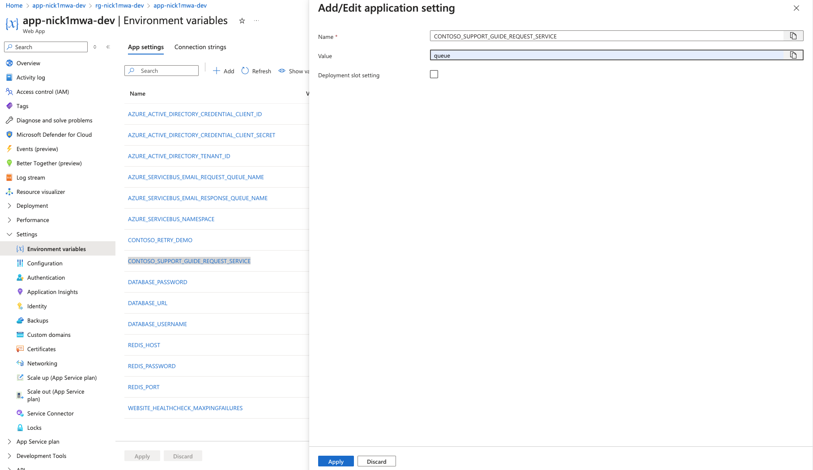

# Pattern Simulations

## Strangler Fig Pattern

Read the [Strangler Fig Pattern](./docs/SranglerFig.md) documentation.

After you deploy CAMS using `azd up`, the application is configured to use the legacy email service. This is simulated by issuing a log message when the email functionality is called. To simulate the functionality, follow the steps below:

1. Open the CAMS application in a browser.
1. Add an Account by clicking on the `Accounts` link in the navigation bar and click `Add Account`.

    

1. Click on the `New Support Case` button to create the Support Ticket.

    

1. Click on the support case and and then click the `Email Customer` button. You will see log message in the support case that the email was sent.

    
You will also see a log message from the email service that the email was sent in the Azure portal.

    

1. To see email requests go to the Azure Service Bus, change the `CONTOSO_SUPPORT_GUIDE_REQUEST_SERVICE` environment variable to `queue` for the App Service.

    

1. Navigate to the Container App in the Azure portal and click on the `Log Stream` link in the left navigation. 

    

1. Navigate to the Container App in the Azure portal and click on the `Log Stream` link in the left navigation.

    

1. Follow the same instructions to send an email to the customer. You will see the log messages from the `email-processor` container app and `CAMS`. Refresh the page and you will see that `CAMS` processed a response from the `email-processor`.

    

1. Navigate to the Azure Service Bus in the Azure portal. You will see a spike in incoming messages.

    
